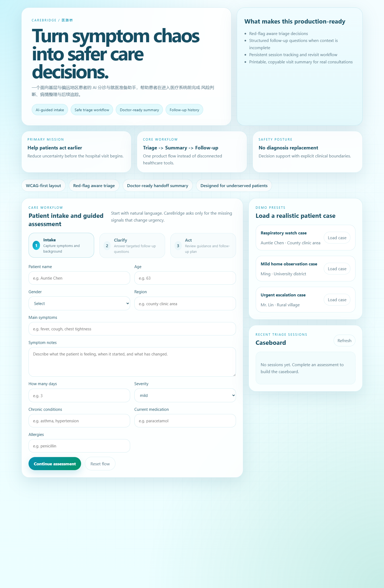
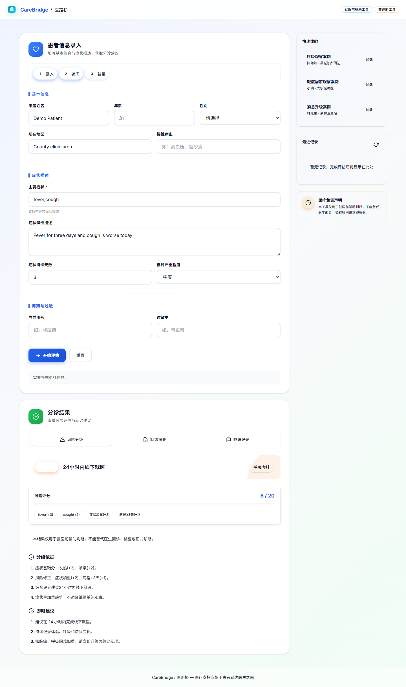
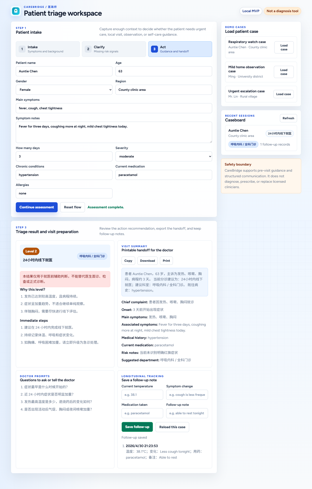

# CareBridge / 医路桥

CareBridge / 医路桥 是一个面向医疗场景的就医前辅助工具。它帮助患者在正式见到医生之前完成症状整理、风险初筛、就诊建议和医生交接摘要生成。

本项目不是诊断系统，也不会替代医生。它的定位是把医疗支持前移，让患者更早知道“是否需要尽快就医、应该去哪类科室、该如何向医生说明病情”。

[English README](./README.md)



## 解决的问题

很多患者，尤其是基层、县域、乡村或医疗资源不足地区的患者，在真正进入医疗系统之前就已经遇到困难：

- 不确定症状是否紧急。
- 不知道应该挂哪个科室。
- 面对医生时难以清楚描述症状。
- 家属无法持续记录病情变化。
- 医生需要花时间重新拼凑患者病史。

CareBridge 关注的不是替代医生诊断，而是改善患者进入医疗系统前的第一步。

## 核心功能

- 患者信息录入：记录姓名、年龄、地区、症状、持续时间、严重程度、慢病史、用药和过敏史。
- 动态追问：当初始信息不足以判断风险时，系统会提出更有针对性的问题。
- 风险分级：根据症状、病程、年龄、体温、加重趋势等因素输出四级就医建议。
- 科室建议：根据症状类别推荐急诊、呼吸科、心内科、消化科、全科门诊等方向。
- 医生交接摘要：自动生成便于复制、打印或展示给医生的结构化摘要。
- 随访记录：保存体温、症状变化、用药和备注，方便观察病情发展。
- 最近记录：可回看历史评估和随访信息。

## 产品截图

### 患者录入工作台


### 分诊结果



### 随访记录



## 使用流程

1. 打开应用首页，填写患者基本信息。
2. 输入主要症状和症状详细描述。
3. 点击“开始评估”。
4. 如果系统需要更多信息，回答补充追问。
5. 查看风险分级、评分依据、即时建议和推荐科室。
6. 切换到“就诊摘要”，获取医生交接内容。
7. 切换到“随访记录”，保存后续观察情况。

## 风险分级说明

CareBridge 当前使用四级建议：

- Level 1：立即急诊。
- Level 2：24 小时内线下就医。
- Level 3：可预约普通门诊。
- Level 4：居家观察并持续记录。

系统会保守处理红旗症状。例如严重呼吸困难、胸痛伴呼吸困难、高热伴症状加重等情况会优先升级处理。

## 安全边界

- 本工具仅用于就医前辅助判断。
- 本工具不能替代医生面诊、检查或正式诊断。
- 如果出现明显危险信号，应立即线下就医或呼叫急救支持。
- 当前 MVP 使用本地 JSON 文件保存数据，不适合直接存储真实敏感医疗数据。

## 技术架构

- 前端：Vue 3、Vite、Pinia、Vue Router、TypeScript。
- 后端：Node.js、Express。
- 数据存储：本地 JSON 文件，位于 `data/` 目录。
- 测试：Vitest、Supertest、Playwright。
- 交付资产：产品截图和 PDF 说明材料。

## 本地运行

安装依赖：

```bash
npm install
```

构建前端并启动服务：

```bash
npm run build
npm start
```

打开浏览器访问：

```text
http://127.0.0.1:4173
```

## 开发模式

开发时可以分别启动后端和 Vite 前端开发服务：

```bash
npm run dev
npm run dev:client
```

开发地址：

```text
http://127.0.0.1:5173
```

## 测试与验证

```bash
npm run type-check
npm run build
npm run test:coverage
npm run test:e2e
npm test
```

生成提交用截图和 PDF：

```bash
npm run capture:screenshots
npm run build:pdf
```

## 仓库结构

```text
.
├── client                  前端 Vue 应用
├── src                     Express 后端与分诊规则
├── tests                   单元、API 与端到端测试
├── scripts                 截图与 PDF 生成脚本
├── doc                     产品文档、截图与提交材料
├── server.js               服务启动入口
├── package.json            项目脚本与依赖
├── README.md               英文项目说明
└── README-zn.md            中文项目说明
```

## 文档

- [English README](./README.md)
- [详细中文说明文档](./doc/说明文档-中文.md)
- [产品设计文档](./doc/产品设计.md)
- [提交 PDF](./doc/CareBridge-Hackathon-Deck.pdf)
- [开源许可证](./LICENSE)
- [安全说明](./SECURITY.md)

## 黑客松展示重点

- 项目完整：有前端、后端、数据存储、测试和交付文档。
- 场景明确：聚焦“就医前”这个容易被忽视但真实存在的医疗痛点。
- 风险克制：强调辅助判断和医生交接，不冒充诊断系统。
- 可演示性强：评委可以在几分钟内走完整个患者流程。

## 项目愿景

医疗支持不应该只在患者见到医生之后才开始。CareBridge 希望让患者更早获得清晰、安全、可执行的就医准备。
